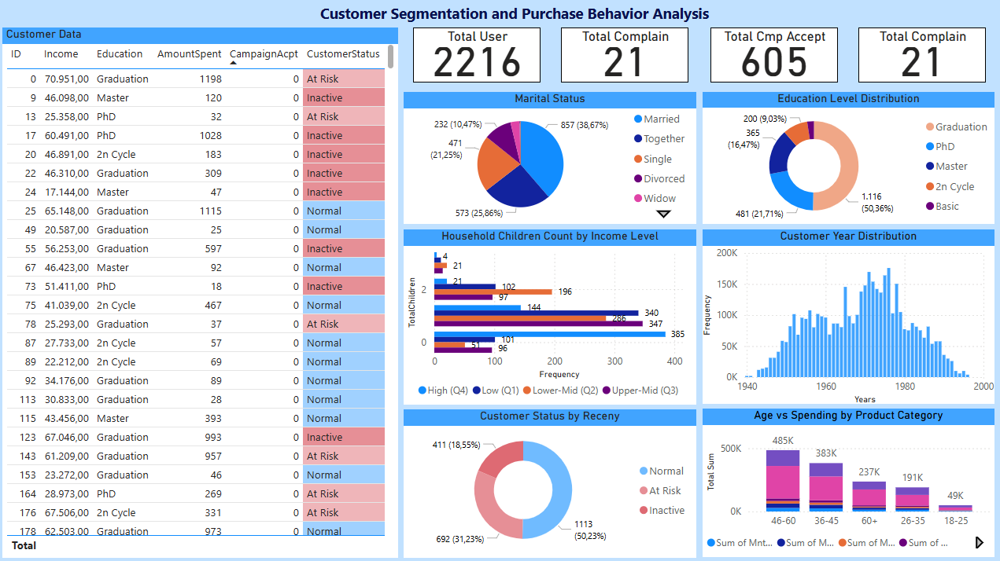

# 📊 Power BI – Customer Analytics Dashboard

This project is a **Power BI dashboard** designed to analyze customer data and provide valuable business insights.  
The dataset contains customer demographics, spending habits, campaign responses, and channel usage patterns.

--
## Current Dashboard

---

## 🎯 Objective
- Understand the overall customer profile
- Identify purchasing behavior and preferred product categories
- Analyze marketing campaign acceptance rates
- Compare performance of different purchasing channels
- Segment customers based on RFM (Recency, Frequency, Monetary) analysis

---

## 📂 Dataset

**Source:** [Customer Personality Analysis – Kaggle](https://www.kaggle.com/datasets/imakash3011/customer-personality-analysis)  
This dataset contains demographic, product preference, campaign response, and channel usage data for a set of customers.

| Category   | Fields |
|------------|--------|
| **People** | ID, Year_Birth, Education, Marital_Status, Income, Kidhome, Teenhome, Dt_Customer, Recency, Complain |
| **Products** | MntWines, MntFruits, MntMeatProducts, MntFishProducts, MntSweetProducts, MntGoldProds |
| **Promotion** | NumDealsPurchases, AcceptedCmp1–5, Response |
| **Place** | NumWebPurchases, NumCatalogPurchases, NumStorePurchases, NumWebVisitsMonth |

---

## ✅ Completed
- **Demographic Analysis** – Education level, marital status, age distribution  
- **Spending Analysis** – Total spend per product category  
- **Campaign Analysis** – Participation and acceptance rates
- **Customer Status** - Active/Inactive/Risk

## 📌 Planned Features
- **Channel Performance** – Web, catalog, and in-store purchases comparison
- **RFM Segmentation** – Customer classification based on Recency, Frequency, Monetary values

---

## 🛠 Tools & Technologies
- **Power BI Desktop**
- **Power Query**
- **DAX** – Measures, calculations, columns
- **MySQL** – Data source (localhost)
